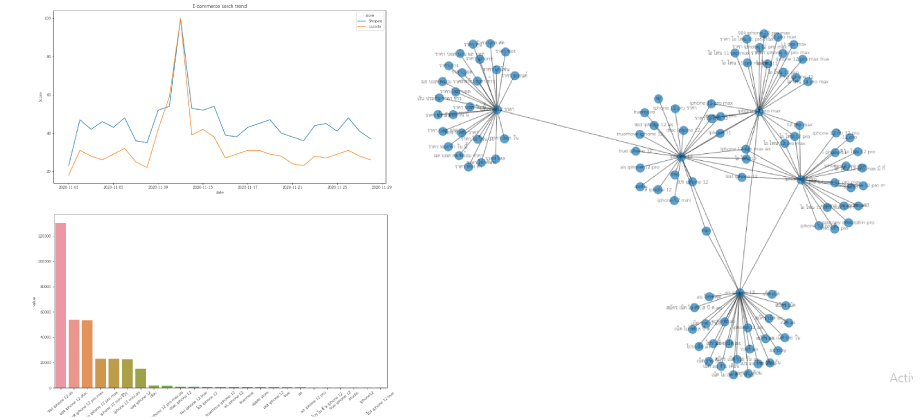

## Hello, welcome to my portfolio

My name is watcharapol Patisang. I am an entry level 
data analytic job seeker. This repository containing 
portfolio of data analysis and data science completed 
by me. The purpose that i am created these projects to 
develop my data analysis skills. Please feel free to 
explore my project.

### Telco customers churn prediction using classification machine learning model.
### [Telco customers churn prediction](https://github.com/Tarwp/Own_Project/blob/main/Telco%20churn%20prediction/Telco_Churn_Prediction.ipynb)
Churn prediction is the solutions to forecast the possibility of trending customers who will quit using the product and services by using the historical data.
Most organizations take the results of churn prediction to identify behavior patterns of customers who are likely to churn. The prediction results will enable organizations 
to segment those customers and able to arrange develop products, services and proper sales strategy for convince customers continue using products and services.
This note book will using the classification machine learning model to predict whether which customers will churn. And we will measure whether the model which is 
the best used to predict this dataset?

### Using pytrend to analyze the google trend 
### [Google trend analysis](https://github.com/Tarwp/Own_Project/blob/main/Pytrend/Pytrend.ipynb)

For this project, I am trying to use pytrend to measure which 
e-commerce has more users searching. And also used pytrend to 
see what users searching about the iphone 12 which trending now.

### E-commerce analysis
This project covers about
* [Exploratory data analysis](https://github.com/Tarwp/Own_Project/blob/main/E-commerce%20Analysis/E-commerce_EDA.ipynb) To explore and summarize their main characteristics of e-commerce data.
* [Cohort analysis](https://github.com/Tarwp/Own_Project/blob/main/E-commerce%20Analysis/E_commerce_Cohort.ipynb) Cohort analysis is very useful for business. It could help you to
follow up customer behavior and understand your business perfomance.
* [RFM analysis](https://github.com/Tarwp/Own_Project/blob/main/E-commerce%20Analysis/E_commerce_RFM.ipynb) RFM analysis could help you to identify customers segment by three factors recency, frequency and monetary
* [Market basket analysis using association rule](https://github.com/Tarwp/Own_Project/blob/main/E-commerce%20Analysis/Association_rules.ipynb)
Market basket analysis make you more understand about behavior of buyer. And will know which items users frequently purchased together.
#### E-commerce monthly report created by tableau
<iframe seamless frameborder="0" src="https://public.tableau.com/views/MonthlyReport_16006154043090/Dashboard1?:language=en&:display_count=yes&:showVizHome=no" width = '1000' height = '800' scrolling='yes' ></iframe>

### And more to come!!
